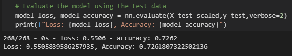

# Neural Network - A Charity Analysis

To use knowledge attained from Machine learning and neural networks creating a binary classifier that is capable of predicting if an applicant will be successful, if funded by the company (Alphabet Soup).

## Purpose

The company would like to know if the charity organization if funded is actually successful with the charity work.
Desiring to implement machine learning and neural network to optimize the model in order to achieve accuracy in successful organization funding.

## Resources

- Data Source CSV file: Charity_data.csv
- VS Code v 1.52.1
- Python 3.7.9
- Pandas
- Scikit-Learn
- TensorFlow v2.4.0

## Results

### A. Preprocessing Data for Neural Network model

1. This model target variable considered is - IS_SUCCESSFUL
2. The rest of the data is considered as the features.
All data was used in order to have sufficient input data available
3. columns that I felt had no relation to the data are EIN, NAME and ORGANIZATION.
    - But when optimizing the model, i did decide to keep the Organization feature to see if there were any major changes.

### B. Clean, Compile, train and Evaluate the model

1. Initial model the number of layers, neurons, activation functions and epochs are shown below.
2. Since this is a binary Classifier model a basic neural network model is said to have 2 to 3 times the input
3. the length of the trained data for the number of inputs
4. Although many trials were done to try and achieve the target model performance, none of the model optimizers done had an effect.
5. Modifying hidden layers increasing the number
    - although 3 layers were the max i went with thinking the data is being over fit.
    - Epochs started small and increased them to see any changes. none made any improvement.
    - Additional feature was removed to see possible outcome.

| Model           | Inputs | Hidden Layers | Neurons                | Activation  | Optimizer | Epochs | Accuracy % |
| :-------------: | :----: | :-----------: | :--------------------: | :---------: | :-------: | :----: | :--------: |
| Original        | 49     | 2             | 20 10                  | relu        | adam      | 50     | 72.61      |
| Optimize 1      | 50     | 3             | 30 25 10               | relu        | adam      | 100    | 72.32      |
| Optimize 2      | 43     | 3             | 80 40 20               | relu        | adam      | 200    | 72.50      |
| Optimize 3      | 43     | 3             | 150 75 40              | relu, swish | adam      | 200    | 72.50      |
| Optimization    | 45     | 3             | 90                     | swish       | adam      | 150    | 72.18      |
| optimization 01 | 50     | 7             | 150 150 80 70 70 35 35 | relu        | adam      | 100    | 72.67      |
| optimization 02 | 71     | 7             | 210 105 50 20 10 35 35 | relu        | adam      | 100    | 72.71      |
| Random Forest   | -      | -             | -                      | -           | -         | -      | 70.5       |
| SVM             | -      | -             | -                      | -           | -         | -      | 72.10      |

## Summary

1. The Accuracy of our initial original basic neural network model was 72.61%, The best accurate results that would be able to predict at 73% accuracy.
2. In using other machine learning classification models, SVM, Random Forest Classifier the accuracy results were the same as all tried models.
3. The next thing would be to see variables that are not of importance and most effective of all would be to have a larger data set.